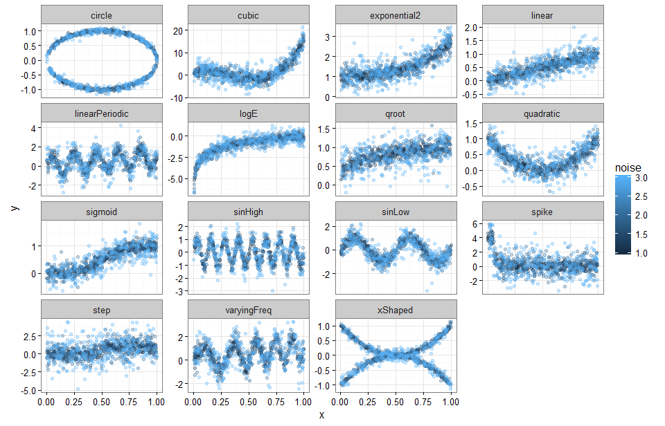

Non-linear Functions

====================

A set of functions for creating different types of relationships between two variables. Each relationship can be generated from different source distributions and allow varying amounts of noise to be added in order to simulate noisy datasets of varying sizes and asymmetry. Functions are implemented in C++ for performance. This is a companion project a power analysis of non-linear associations called [mnla](https://github.com/fjro/mnla). The relationship types can be see below. 
